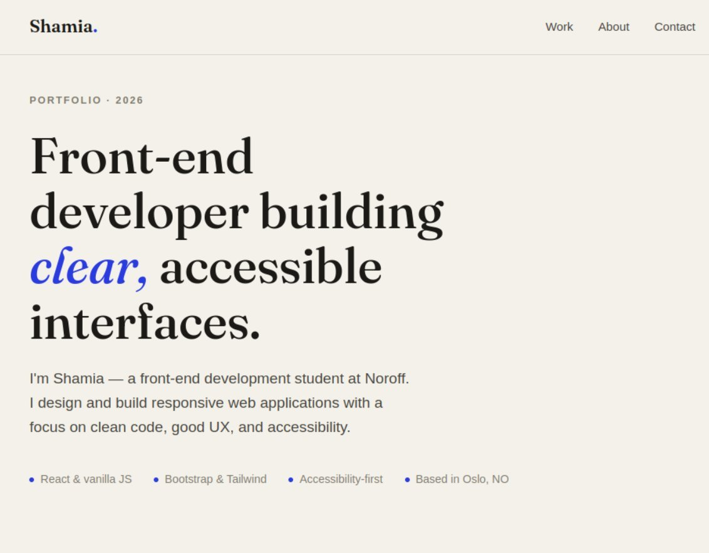

# portfolio2 - Shamia



A multipage portfolio website that showcases three of my Noroff front-end development projects: Talkify (CSS Frameworks), NextCart (JavaScript Frameworks), and BidHub (Semester Project 2). Each project is presented as a teaser card on the home page that links to a dedicated article page with full details.

## Description

This portfolio was built as the Portfolio 2 course assignment. It presents my work professionally, with each project reviewed and improved before being shown.

The site includes:

- A home page with three teaser cards (thumbnail, title, short description, and a link to the article page)
- Three article pages, one per project - each with the project title, a share/copy-link button, a captioned image, a link to the live site, a link to the GitHub README, and a detailed description
- A responsive layout that works on mobile, tablet and desktop
- Accessibility features such as a skip link, semantic HTML, focus styles and a mobile menu that closes after selection

## Built With

- HTML5
- CSS3 (with CSS variables)
- Vanilla JavaScript

## Getting Started

### Installing

This is a plain HTML, CSS and JavaScript project, so there are no dependencies to install.

1. Clone the repo:

```bash

git clone https://github.com/Shamia702/portfolio2.git

```

2. Open the folder in your editor:

```bash
cd portfolio2
code .
```

### Running

Because it is a static site, you can run it without any build tools:

- Open `index.html` directly in your browser, **or**
- In VS Code, right-click `index.html` and choose **Open with Live Server**.

## Live Site

The site is deployed with GitHub Pages:

👉 https://shamia702.github.io/portfolio2/

## Featured Projects

- **Talkify** — Social media app (CSS Frameworks) · [Live](https://talkify-webapp.netlify.app) · [Repo](https://github.com/Shamia702/social-media-app)

- **NextCart** — Online shop (JavaScript Frameworks) · [Live](https://jsfw-2025-v1-shamia-s-javascript-fr.vercel.app/) · [Repo](https://github.com/NoroffFEU/jsfw-2025-v1-shamia-s-javascript-frameworks-ca)

- **BidHub** — Student auction house (Semester Project 2) · [Live](https://bidhub-site.netlify.app/) · [Repo](https://github.com/Shamia702/SP2-BidHub)

## Contact

- [My LinkedIn page](https://www.linkedin.com/in/shamia-shamia-6892a81a2/)
- [My GitHub page](https://github.com/Shamia702)

## Acknowledgments

- Noroff front-end development course materials and README template
